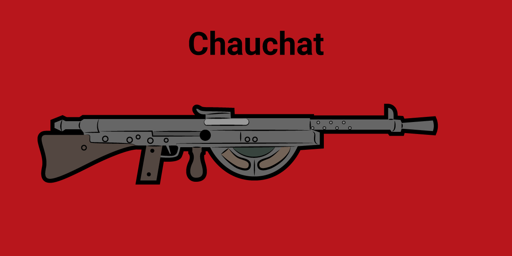

# Chauchat



La ametralladora con mayor producción durante la Primera Guerra Mundial, la Chauchat fue la primera de este tipo de armas lo suficientemente ligera como para poder ser operada por un sólo soldado, incluso para disparar desde la cintura en marcha.

Utilizada por los ejércitos franceses así como por los norteamericanos, estos últimos desvelaron una serie de fallos que la convirtieron también en probablemente la peor ametralladora de la historia.


Sus principales problemas eran:

1. El cargador estaba abierto por un lado y el lodo bloqueaba el mecanismo, haciéndola inservible.

2. Se calentaba demasiado, por lo que se recomendaba a los soldados disparar solamente en ráfagas cortas.


En este ejercicio, se pretende hacer una Chauchat virtual que reproduzca el citado comportamiento.

1. Por un lado habrás de crear una variable `cargador` donde habrá de guardar unos 7 **_"pium!"_**

2. El otro elemento será nuestra **chauchat**, que "hace cosas", y será donde pondremos el cargador para que haga cosas.

    `chauchat(cargador)`

    Cuando ejecutemos dicho código, veremos impresos todos los **_"pium!"_** del cargador, uno tras otro.

    En el caso de 3 **_"pium!"_** en el cargador, veremos en la consola:

    ```
    pium!
    pium!
    pium!
    ```

Después, representaremos los dos problemas principales:

3. Al tener el cargador abierto, era posible que se bloquease si algo entraba, como una "ramita".

    Digamos que existe un 80% de probabilidad de que se quede "pillada":

    - Si se queda pillada, no habrá tiros y sólo mostrará un mensaje: _"¡Me encasquillé!"_

    (Pista: Para poder generar aleatoridad, se recomienda usar un paquete externo de Python)

4. Para evitar que se caliente y se bloquee, cada tres disparos se imprimirá un renglón vacío, para dar aire y espacio:

    ```
    pium!
    pium!
    pium!

    pium!
    pium!
    pium!

    pium!
    pium!
    pium!
    ```

5. Por último, y si no se había hecho así ya desde el principio, crear la clase Chauchat que contenga todas las propiedades y métodos antes citados dentro del objeto, para poder reutilizarla instanciando todas las que se deseen.