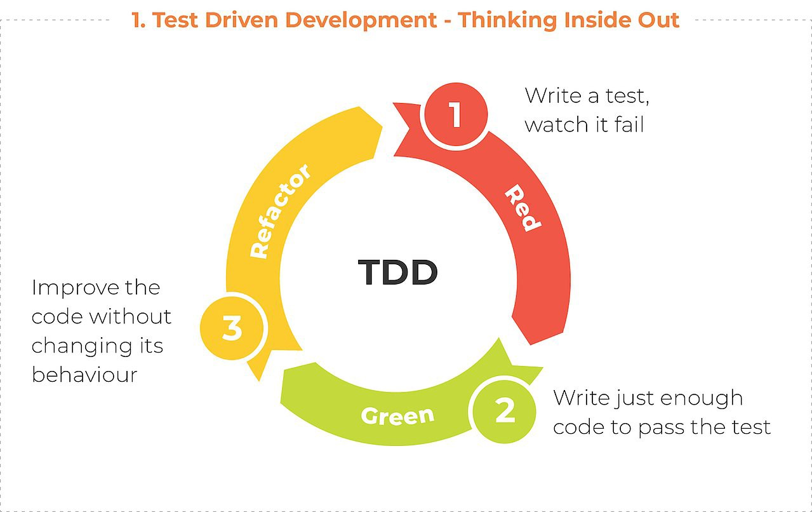

# Proyecto 5: Simulando Big Data

## Índice

[1. Trabajar con grandes cantidades de datos](#1-trabajar-con-grandes-cantidades-de-datos)  
[2. Medición de rendimiento: Librería time](#2-medición-de-rendimiento-librería-time)  
[3. Control de calidad: Pruebas unitarias](#3-control-de-calidad-pruebas-unitarias)  
[4. Librería doctest](#4-librería-doctest)  
[5. Trabajo con datos estructurados binarios](#5-trabajo-con-datos-estructurados-binarios)  
[6. Multihilos](#6-multihilos)  
[7. Sistema de logs](#7-sistema-de-logs)  
[8. Garbage Collections. Sistema de control de memoria](#8-garbage-collections-sistema-de-control-de-memoria)

## 1. Trabajar con grandes cantidades de datos

- Desarrollar un chatbot con los siguientes hilos de ejecución:
  - Tarea 1: 
    1. Pide al usuario su fecha de nacimiento en formato `YYYY-MM-DD`.
    2. Añade dicha fecha a un fichero de texto (una fecha por línea).
    3. Pregunta al usuario si quiere meter otra fecha más. Si es así, vuelve al paso 1; si no, termina su ejecución.
  - Tarea 2:
    1. Cada vez que se añade una nueva fecha, lee el fichero donde estas se están recogiendo.
    2. Calcula cuántas personas hay de cada horóscopo y lo muestra por consola. Ejemplo:
         - Tauro 3
         - Piscis 1
- Nivel 2 de dificultad (opcional): Lo mismo que el anterior pero orientado a objetos (con clases).
- Medir el tiempo neto que tarda cada tarea en su ejecución y mostrarlo por consola a su finalización.
- Hacer tests unitarios para cada una de las funciones (o métodos en su caso) implementadas (/os).

## 2. Medición de rendimiento: Librería time

La librería `time` permite obtener información detallada del tiempo de CPU que consumen los procesos de nuestro código, de manera que podemos medir así su rendimiento de cara a optimizar aquellas partes del mismo que consuman recursos de forma excesiva.

Algunos de los métodos más relevantes de la librería son los siguientes:

- `perfcounter()`

      import time

      start_time = time.perf_counter()
      print("Hola Mundo")
      end_time = time.perf_counter()
      
      print(f"Inicio: {start_time}")
      print(f"Fin: {end_time}")
      print(f"Duración: {end_time - start_time:0.6f}" )

- `monotonic()`

      import time
  
      start_time = time.monotonic()
 
      print(f"Inicio: {start_time}")
      
      user_input = input("Introduce un número:")
      print(str(user_input))
      
      end_time = time.monotonic()
      
      print(f"Fin: {end_time}")
      print(f"Duración: {end_time - start_time}" )

- `process_time()`

      import time

      start_time = time.process_time()
      # start_time = time.perf_counter()

      print(f"Inicio: {start_time}")
      
      time.sleep(3)
      
      i = 0
      for i in range(1000000):
        i = i + 1
      
      print(f"El bucle iteró {str(i)} veces")

      end_time = time.process_time()
      # end_time = time.perf_counter()

      print(f"Fin: {end_time}")
      print(f"Duración: {end_time - start_time}" )

- `time()`

      import time
 
      # Obtener el tiempo epoch (origen) del sistema

      temp = time.gmtime(0)
      epoch = time.asctime(temp)
      print(f"Epoch es: {epoch}")
      
      # Obtener el tiempo transcurrido desde el epoch

      time_now = time.time()
      print(f"Tiempo desde epoch: {time_now}")

Nota: Algunas presentan una versión con el sufijo *_ns* (e.g. `perfcounter_ns()`), que devuelven el tiempo en nanosegundos.

Es una buena idea implementar una clase Timer para instanciar un objeto que tenga todos los métodos necesarios para trabajar con el tiempo:

      import time
      
      class Timer:
        def __init__(self):
          self._start_time = None
        
        def start(self):
          if self._start_time is None:
            self._start_time = time.perf_counter()
        
        def stop(self):
          if self._start_time is not None:
            elapsed_time = time.perf_counter() - self._start_time
            self._start_time = None
            
            print(f"Transcurrido: {elapsed_time:0.4f} segundos")
      
      new_timer = Timer()

      new_timer.start()

      time.sleep(10)
      
      new_timer.stop()

## 3. Control de calidad: Pruebas unitarias

Entre las distintas fases del desarrollo de un proyecto software, existe una conocida como la fase de pruebas, que se encarga de tratar de asegurar unos mínimos de calidad del software implementado.

Existen muchos tipos de pruebas, entre ellas las conocidas como unitarias (unit tests), enmarcados dentro de la metodología TDD (Test-Driven Development, o Desarrollo Guiado por Pruebas).

Esta metodología trata de enfocar el desarrollo hacia la superación de pruebas individuales para todos (o la mayoría de) los tipos de casos particulares que pueden darse al llamar a una función.

El flujo de trabajo determina empezar por escribir el test, fallido desde el principio; después escribir el código que lo pasa; finalmente la refactorización de dicho código y vuelta a empezar con el siguiente test.

## 4. Librería doctest

La librería `doctest` sirve para realizar pruebas unitarias de funciones fácilmente, expresándolas en forma de documentación (mediante comentarios):

    import doctest

    def totalSumDouble(*args):
      """
      Devuelve la suma del doble de todos sus parámetros

      Pruebas a realizar
      (entrada determinada y salida esperada):

      >>> totalSumDouble(1, 2, 3)
      12
      
      >>> totalSumDouble(-10, 15)
      0
      """
      return sum(args * 2)
    
    doctest.testmod(name='totalSumDouble', verbose=True)

De esta forma, en un bloque de comentarios, se usa el prefijo `>>>` para indicar el código del test, y justo debajo la salida esperada.

El siguiente es un ejemplo en el que los tests van "guiando" el desarrollo (aplicando TDD):

    import doctest

    def palindrome(word):
      """
      Devuelve True si la palabra pasada por parámetro
      es un palíndromo y False en caso contrario

      >>> palindrome("radar")
      True

      >>> palindrome("tractor")
      False
      
      >>> palindrome("Ada")
      True
      """
      if word == word[::-1]:
        return True
      else:
        return False
      
      doctest.testmod(name='palindrome', verbose=True)

El test falla, porque es sensible a mayúsculas (*case sensitive*), cuando no debería serlo, así que puede modificarse el condicional por este otro:

    if word.lower() == word[::-1].lower():

Si añadimos un test que tiene espacios, también falla, cuando no debería:

    >>> palindrome("A dama amada")
    True

Lo que implica ajustar el código para que pase el test (sin dejar de pasar el resto):

    if word.lower().replace(" ", "") ==
      word[::-1].lower().replace(" ", ""):

Y así sucesivamente para todos los casos que se deseen contemplar (tildes, etc.).

## 5. Trabajo con datos estructurados binarios

A partir de la versión 3 de Python, el lenguaje maneja el tipo de datos `bytes` de forma independiente e incompatible al tipo `str` convencional.

Una variable de tipo `bytes` se considera como un "string de bytes" que además es inmutable, lo que significa que una vez inicializada no se puede cambiar:

    bytestr = bytes(b'pepinillo')

    print(bytestr) # b-notation

    bytestr[0] = 111

El valor de una variable de tipo bytes se puede expresar en el sistema numérico decimal (base 10) o hexadecimal (base 16):

    bytestr = bytes(b'pepinillo')

    print(bytestr[0]) # decimal
    print(hex(bytestr[0])) # hexadecimal

Para la conversión entre `bytes` y `str` es necesario especificar un juego de caracteres (*charset*) concreto (e.g., UTF-8, Latin o ASCII), o el resultado será distinto:

    bytestrhex = b'\xe2\x82\xac' # hexadecimal

    print(bytestrhex.decode('utf-8'))
    print(bytestrhex.decode('latin-1'))

Si se desea trabajar con bytes de forma que sí se puedan modificar, se pueden tratar como arrays de bytes:

    bytesArr = bytearray(b'\x00\x0F')

    bytesArr[0] = 255
    bytesArr.append(255)

    for i in bytesArr:
      print(i)

Las operaciones a realizar con este tipo son las conocidas como a nivel de bit:

- AND (a & b): Devuelve 1 solo si los dos bits son 1.
- OR (a | b): Devuelve 0 solo si los dos bits son 0.
- NOT (~a): Devuelve lo contrario.
- XOR (a ^ b): Devuelve 1 solo si uno de los dos bits es 1.
- Desplazamiento a la derecha (>>): Mueve tantos bits como los indicados a la derecha, rellenando con ceros o unos por la izquierda, dependiendo de si el número es positivo o negativo, respectivamente.
- Desplazamiento a la izquierda (<<): Mueve tantos bits como los indicados a la izquierda, rellenando con ceros por la derecha.

      a = 10
      b = 4
      c = -5
      
      print("a & b =", a & b)
      print("a | b =", a | b)
      print("~a =", ~a)
      print("a ^ b =", a ^ b)
      
      print("a >> 1 =", a >> 1)
      print("c >> 1 =", c >> 1)
      
      print("b << 1 =", b << 1)
      print("c << 1 =", c << 1)

## 6. Multihilos

En el ámbito de la programación concurrente, también llamada paralela, se manejan los conceptos de multiprocesamiento y multihilo (multithreading) para realizar varias tareas "al mismo tiempo" o, mejor dicho, concurrentemente.

Esto significa que en el primer caso las tareas sí se ejecutan al mismo tiempo (como procesos), ya que hay varios procesadores (núcleos) para realizarlas, mientras que en el segundo se trata de una sensación más o menos percibida a partir del reparto continuo del procesador entre los distintos hilos de ejecución.

Si un proceso es un programa en ejecución, los hilos son subprocesos creados por un proceso superior, con los que comparte un supercontexto global y a los que otorga a cada uno su propio contexto (variables, etc.), de manera que además se puedan comunicar entre sí.

En Python se pueden generar y ejecutar procesos fácilmente a partir de funciones:

    import threading

    def print_cube(num):
      print(f"Cubo: {num * num * num}")

    def print_square(num):
      print(f"Cuadrado: {num * num}")

    # Ejecutado solo en el programa principal
    if __name__ =="__main__":
      
      # Crear threads
      t1 = threading.Thread(target=print_square, args=(10,))
      t2 = threading.Thread(target=print_cube, args=(10,))

      # Ejecutar threads
      t1.start()
      t2.start()

      # Esperar a la finalización de los threads
      t1.join()
      t2.join()

      print("Fin del programa")

Tanto los procesos (incluyendo el del programa principal) como los threads tienen un nombre así como un identificador (pid), que es posible conocer:

    import threading
    import os

    def task1():
      print(f"Tarea 1 - Thread {threading.current_thread().name}")
      print(f"pid del proceso de la tarea 1: {os.getpid()}")

    def task2():
      print(f"Tarea 2 - Thread {threading.current_thread().name}")
      print(f"pid del proceso de la tarea 2: {os.getpid()}")

    if __name__ == "__main__":

      print(f"Programa principal - Thread {threading.current_thread().name}")
      print(f"pid del proceso del programa principal: {os.getpid()}")

      t1 = threading.Thread(target=task1, name='tarea1')
      t2 = threading.Thread(target=task2, name='tarea2')

      t1.start()
      t2.start()

      t1.join()
      t2.join()

En ocasiones dos o más hilos acceden a los mismos recursos compartidos (también llamados secciones críticas), lo que puede originar condiciones de carrera, que implican resultados distintos dependiendo de qué hilo accedió primero:

      import threading

      def task1():
        for i in range(5):
          print('Tarea 1')
      
      def task2():
        for i in range(5):
          print('Tarea 2')

      if __name__=="__main__":
        t1 = threading.Thread(target=task1)
        t2 = threading.Thread(target=task2)

        t1.start()
        t2.start()

        t1.join()
        t2.join()

Para evitar esto, existen diversos mecanismos como los semáforos o el del siguiente ejemplo, conocido como bloqueo (`Lock`), cerrojo o exclusión mutua:

      import threading
      lock = threading.Lock()

      def task1():
        for i in range(5):
          lock.acquire()
          print('Tarea 1')
          lock.release()
      
      def task2():
        for i in range(5):
          lock.acquire()
          print('Tarea 2')
          lock.release()

      if __name__=="__main__":
        t1 = threading.Thread(target=task1)
        t2 = threading.Thread(target=task2)

        t1.start()
        t2.start()

        t1.join()
        t2.join()

## 7. Sistema de logs

Cuando un software está ejecutándose, a veces es útil que este vaya tomando nota o registro en un fichero que posteriormente se examine o evalúe de cara a encontrar posibles errores o tracear los momentos en los que ocurrieron ciertas cosas.

El módulo de `logging` permite escribir mensajes de registro en un fichero ofreciendo algunos métodos específicos para este tipo de tarea, como por ejemplo:

- Nivel de importancia
  - logger.setLevel(level)
  - logger.info(msg)
  - logger.warning(msg)
  - logger.error(msg)
  - logger.critical(msg)
- Filtrado
  - logger.addFilter(filter)
  - logger.removeFilter(filter)
  - logger.filter(record)
- Manejadores
  - logger.addHandler(handler)
  - logger.removeHandler(handler)
  - logger.hasHandlers()

Los pasos básicos a realizar para crear un sistema de logs serían los siguientes:

1. Establecer la configuración general de logging (formato del mensaje, nombre del fichero de salida y tipo de acceso, etc.)
2. Crear el objeto logger
3. Determinar el nivel mínimo de los mensajes a escribir en el fichero de registro:
    - Debug - 10
    - Info - 20
    - Warning - 30
    - Error - 40
    - Critical - 50
4. Usar el logger durante la ejecución del programa

        import logging

        # Establecer la configuración general 
        logging.basicConfig(filename="newfile.log",
                            format='%(asctime)s %(message)s',
                            filemode='w')

        # Crear el logger y determinar nivel mínimo
        logger = logging.getLogger()
        logger.setLevel(logging.DEBUG)

        # Usar el logger durante la ejecución del programa
        logger.debug("Estamos depurando")
        logger.info("Las cosas son como son")
        logger.warning("Te lo advierto")
        logger.error("División por cero")
        logger.critical("No hay Internet")

## 8. Garbage Collections. Sistema de control de memoria

Además de la CPU, el otro recurso principal que un software consume en su ejecución es es la memoria del sistema que lo está ejecutando. Python es un lenguaje dinámico, lo que significa que tiene mecanismos de automatización de reserva y liberación de memoria que permiten al programador despreocuparse (en parte) de esta cuestión.

Sin embargo, eso no significa que se deje totalmente de lado o no se haga un uso responsable de la memoria, dado que nuestro software no solo tiene que ser eficaz sino también eficiente, lo que implica que además de cumplir con los requisitos de funcionalidad solicitados, también hay que atender al rendimiento de los procesos.

Python maneja dos conceptos principales en términos de gestión de la memoria utilizada:

- Contar referencias

Una referencia es una posición de memoria, es decir, una dirección que apunta a un dato (internamente representado como objeto) que puede ser más o menos voluminoso, desde un número hasta una lista de muchos elementos donde cada uno a su vez es un diccionario (lo que implicaría más referencias).

    import sys

    a = 'my-string'
    b = [a]
    c = { 'key': a }
    
    sys.getrefcount(a)

    del a
    del b

    sys.getrefcount(a)

- Recolección de basura

Se pueden establecer umbrales de número máximo de referencias para que el recolector de basura de Python las libere:

    import gc

    print(f"Garbage collection thresholds: {gc.get_threshold()}")

    gc.set_threshold(500)

O también hacerlo de forma manual en el código:

    import gc

    collected = gc.collect()

    print(f"Garbage collector: {collected} objects.")

## Referencias

[Funciones de temporización (I)](https://www.nickmccullum.com/python-timer-functions-performance-measurement/)  
[Funciones de temporización (II)](https://realpython.com/python-timer/)  
[Metodología TDD](https://www.ionos.es/digitalguide/paginas-web/desarrollo-web/que-es-el-test-driven-development/)  
[Pruebas unitarias con doctest](https://docs.hektorprofe.net/python/documentacion-y-pruebas/doctest/)  
[Trabajando con datos binarios](https://www.geeksforgeeks.org/working-with-binary-data-in-python/)  
[Operadores a nivel de bit](https://www.geeksforgeeks.org/python-bitwise-operators/)  
[Multihilos (I)](https://www.geeksforgeeks.org/multithreading-python-set-1/)  
[Multihilos (II)](https://www.geeksforgeeks.org/multithreading-in-python-set-2-synchronization/)    
[Multihilos (III)](https://www.guru99.com/python-multithreading-gil-example.html)  
[Registro (I)](https://www.geeksforgeeks.org/logging-in-python/)  
[Registro (II)](https://realpython.com/python-logging/)  
[Recolección de basura (I)](https://www.geeksforgeeks.org/garbage-collection-python/)  
[Recolección de basura (II)](https://stackify.com/python-garbage-collection/)