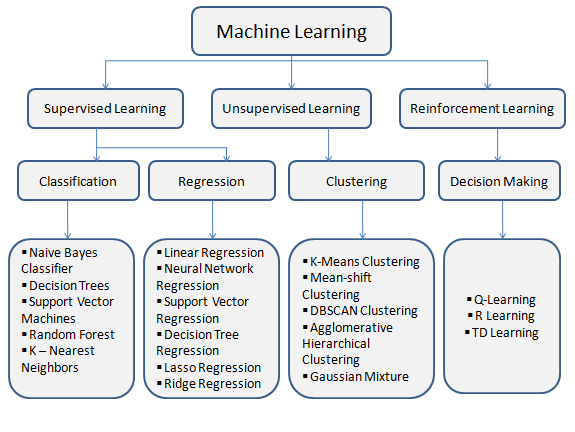
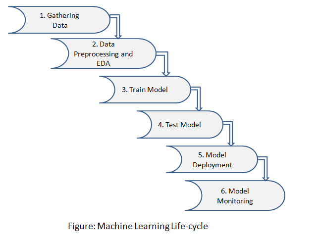

# Proyecto 8: AI

## Índice

[1. Introducción al aprendizaje automático](#1-introducción-al-aprendizaje-automático)  
[2. Introducción a los algoritmos de Machine Learning](#2-introducción-a-los-algoritmos-de-machine-learning)  
[3. ML en Python: librería scikit-learn (sklearn)](#3-ml-en-python-librería-scikit-learn-sklearn)  
[4. Esquema de trabajo en ML](#4-esquema-de-trabajo-en-ml)  
[5. Carga de dataset](#5-carga-de-dataset)  
[6. Limpieza de dataset](#6-limpieza-de-dataset)  
[7. Aplicación de scikit-learn](#7-aplicación-de-scikit-learn)  
[8. Revisión de resultados](#8-revisión-de-resultados)  

## 1. Introducción al aprendizaje automático

- .

## 2. Introducción a los algoritmos de Machine Learning

### Conceptos básicos

- Inteligencia artificial: Engloba todo aquello que pretende que una máquina, que en general es un ordenador con su correspondiente software, imite la forma de razonar de una mente humana.
- Ciencia de datos: Abarca la aplicación de matemáticas, estadística y programación, orientadas a convertir en información útil enormes conjuntos de datos.
- Aprendizaje automático: Consiste en diseñar y programar modelos matemáticos que, analizando grandes conjuntos de datos, sean capaces de aprender a detectar patrones y reglas ocultas en la estructura de esos datos. Este proceso se realiza mediante algoritmos, que se categorizan en:
  - Aprendizaje supervisado
  - Aprendizaje no supervisado
  - Aprendizaje por refuerzo
  
    

- Aprendizaje profundo: Más complejo que el anterior, implica el entrenamiento de redes neuronales que sean capaces de reconocer patrones más complicados y no tan lineales, como por ejemplo caras humanas, gestos o incluso estados de ánimo.

### Tipos de algoritmos

- De regresión
  - Por mínimos cuadrados ordinarios (OLSR)
  - Lineal
  - Logística
  - Por pasos
  - Líneas de Regresión Adaptativa Multivariante (MARS)
  - Suavizado de la trama de dispersión estimada localmente (LOESS)
- Basados en la memoria
  - k-Vecino más cercano (kNN)
  - Cuantificación de Vectores de Aprendizaje (LVQ)
  - Mapa auto-organizativo (SOM)
  - Aprendizaje ponderado local (LWL)
  - Máquinas Vectoriales de Apoyo (SVM)
- De regularización
  - Regresión de cresta
  - Operador de Selección y Encogimiento Mínimo Absoluto (LASSO)
  - Red elástica
  - Regresión de ángulo menor (LARS)
- Redes neuronales artificiales

## 3. ML en Python: librería scikit-learn (sklearn)

Scikit-learn (o sklearn) es una librería de Python de código abierto para el aprendizaje automático, que soporta algoritmos de última generación como KNN, XGBoost, bosque aleatorio, SVM, entre otros.

Es ampliamente utilizada por grandes empresas y por la comunidad Kaggle para realizar las principales fases del aprendizaje automático, como el preprocesamiento, reducción de dimensionalidad (selección de parámetros), clasificación, regresión, agrupación y selección de modelos.

Se puede instalar (en un entorno virtual) de la siguiente manera, junto a las otras librerías que más comúnmente se usan para la carga o limpieza de los datos (`numpy` y `pandas`):

    virtualenv env-sklearn
    source env-sklearn/bin/activate

    pip install -U scikit-learn
    pip install numpy
    pip install pandas

## 4. Esquema de trabajo en ML

1. Recopilación de datos
2. Procesamiento previo y análisis exploratorio de datos
3. Entrenamiento del modelo
4. Prueba del modelo
5. Despliegue del modelo
6. Monitorización del modelo

## 5. Carga de dataset

La carga de los datos se puede hacer fácilmente con la librería `pandas` desde un fichero CSV, Excel, JSON, HTML o XML:

    import pandas as pd

    dataFromCsv = pd.read_csv('data.csv')
    dataFromExcel = pd.read_excel('data.xlsx')
    dataFromJson = pd.read_json('data.json')
    dataFromHtml = pd.read_html('data.html')
    dataFromXml = pd.read_xml('data.xml')

O también mediante SQL directamente de una base de datos (por tabla o consulta):

    import pandas as pd
    import sqlite3

    connection = sqlite3.connect("data.db")

    dataFromTable = pd.read_sql('users', connection)
    dataFromQuery = pd.read_sql('SELECT * FROM users WHERE profile = 1', connection)

Por último, podría haber otras formas de obtener los datos, como por ejemplo haciendo webscraping o solicitándolos a una API remota.

## 6. Limpieza de dataset

Una vez cargados los datos (con las opciones pertinentes):

    import pandas as pd

    data = pd.read_csv(
      'customers-100-raw.csv',
      converters = { 'Age' : lambda x : int(x) }
    )

Es conveniente hacer un proceso previo de limpieza para eliminar aquellos que pueden desvirtuar los resultados a obtener.

Como primer paso, se pueden buscar datos vacíos, desconocidos o nulos:

    print(data.isnull().sum())

Después eliminar aquellas columnas de las que no se desee obtener nada o tengan todos sus datos nulos:

    remove = ['Index','Customer Id','Phone 1','Phone 2','Email','Website']
    data.drop(remove, inplace=True, axis=1)

Para aquellas columnas que sí interese conservar pero que tengan algunos valores nulos, estos pueden reemplazarse por algún valor prefijado:

    data['First Name'] = data['First Name'].fillna('Unknown')
    data['Last Name'] = data['Last Name'].fillna('Unknown')
    data['Company'] = data['Company'].fillna('Unknown')
    data['City'] = data['City'].fillna('Unknown')
    data['Country'] = data['Country'].fillna('Unknown')
    data['Subscription Date'] = data['Subscription Date'].fillna('1970-01-01')

El siguiente paso es comprobar los posibles duplicados y eliminarlos:

    print(data.duplicated())

    data = data.drop_duplicates()

    print(data.duplicated())

A continuación hay que detectar valores atípicos, de cara a eliminarlos o sustituirlos por otros que sean más coherentes:

    print(data['Age'].describe())

    data = data[data.Age > 17]
    data = data[data.Age < 101]

    print(data['Age'].describe())

Y así se puede seguir haciendo otras operaciones como capitalizar o pasar a minúsculas campos de texto para normalizarlos según cierto criterio:

    data['Last Name'] = data['Last Name'].str.title()
    data['Email'] = data['Email'].str.lower()

Etcétera.

## 7. Aplicación de scikit-learn

En los ejemplos siguientes se va a trabajar con los datasets proporcionados por la librería para la realización de pruebas y aprendizaje:

    from sklearn import datasets
    import pandas as pd
    import numpy as np

    wine = datasets.load_wine()

    data = pd.DataFrame(data= wine['data'],
                        columns= wine['feature_names'])

    y = wine['target']
    print(y[:10])
    data.head()

Para el preprocesamiento de los datos, el primer paso a realizar es la separación ( *split* ) entre los datos de entrenamiento ( *train* ) y de prueba ( *test* ):

    from sklearn.model_selection import train_test_split

    X_train, X_test, y_train, y_test = train_test_split(data, y, 
                                                        test_size = 0.8,
                                                        random_state = 1234)

    print(f'X train shape {X_train.shape} \nX test shape {X_test.shape}')

A continuación habría que limpiar el dataset de valores atípicos (también llamados valores perdidos), lo cual se puede hacer con métodos específicos de imputación univariante (de la media, mediana, moda o un valor fijo) o imputación multivariante (mediante un regresor, como por ejemplo con el algoritmo kNN).

La librería ofrece clases específicas para hacer todas estas operaciones. Por ejemplo, una imputación univariante por la moda se haría:

    from sklearn.impute import SimpleImputer

    mode_imputer = SimpleImputer(strategy = 'most_frequent')

    for column in data_na.columns:
      values = data_na[column].values.reshape(-1,1)
      mode_imputer.fit(values)
      data_na[column] = mode_imputer.transform(values)

    data_na.isna().sum()

Después vendría una fase de transformación de los datos, que también es posible realizar con el módulo de `preprocessing` de la librería, y que permite hacer este tipo de operaciones tales como modificar la distribución de una variable, normalizar/estandarizar los datos o convertir variables categóricas en numéricas.

Un ejemplo de esta última es el *one-hot encoding*:

    label = np.array(['USA','Australia', 'UK', 'UK','USA','Australia','USA', UK', 'UK','UK','Australia'])

    from sklearn.preprocessing import OneHotEncoder

    ohencoder = OneHotEncoder(drop='first')
    ohencoder_fit = ohencoder.fit(label.reshape(-1,1))
    ohencoder_fit.transform(label.reshape(-1,1)).toarray()

## 8. Revisión de resultados

.

## Referencias

[Introducción al aprendizaje automático](https://www.escueladenegociosydireccion.com/revista/business/big-data/introduccion-al-aprendizaje-automatico/)  
[Tipos de algoritmos de aprendizaje automático](https://datascience.eu/es/aprendizaje-automatico/los-algoritmos-de-aprendizaje-automatico-mas-populares/)  
[Ejemplos de algoritmos de aprendizaje automático](https://datapeaker.com/big-data/algoritmos-de-aprendizaje-automatico-introduccion-al-aprendizaje-automatico/)  
[Documentación Scikit-learn](https://scikit-learn.org/stable/index.html)  
[Carga de datos con Pandas](https://pandas.pydata.org/pandas-docs/stable/reference/io.html)  
[Limpieza de datos](https://monkeylearn.com/blog/data-cleaning-python/)  
[Tutorial Machine Learning](https://www.w3schools.com/python/python_ml_getting_started.asp)  
[Ejemplos de aprendizaje automático con Scikit-learn](https://anderfernandez.com/blog/tutorial-sklearn-machine-learning-python/)